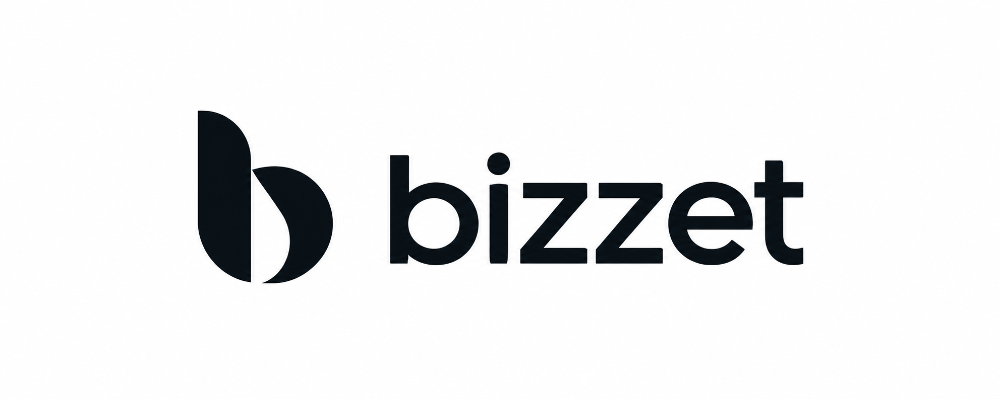

<p align="center"></p>

# bizzet

bizzet is a wallet built for business operations, from receiving sales to managing team funds, with passkey sign-in and multi-member approval on Safe.

This README separates what we built during ETHGlobal Tokyo 2026 from what is only designed. The product description below is the vision; the "What we built" section lists only what exists in this repo and how we verified it.

### 日本語

bizzet は、売上の受け取りからチームの資金管理まで、ビジネスの業務のために作るウォレットで、パスキーでのログインと複数メンバーによる承認を Safe の上で実現します。

この README では、ETHGlobal Tokyo 2026 の期間中に作ったものと、設計だけ済んでいるものを分けて書いています。次の説明はプロダクトの構想であり、「What we built」の節にはこのリポジトリに実在するものとその確認方法だけを載せています。

## Problem and product vision

> This section describes the product vision. Most of it is not built yet; see "What we built" and "Not built yet" below.

A business that accepts crypto payments has to run it as a team: sales arrive at several stores, funds need to be gathered at headquarters, and withdrawals should require more than one person's approval. Ordinary wallets assume a single person holding a seed phrase, which does not fit how a business operates.

In the bizzet vision, an organization is modeled as groups (headquarters and its stores, including online shops), and each group has its own Safe. Members join with a role (Owner, Approver or Viewer) that decides what they can see and do, and rules such as "withdrawals from headquarters need two approvals" are enforced on chain by the Safe threshold. Members sign in and approve with a passkey on their own device, so no one manages private keys and no one pays gas. Store sales are gathered into the headquarters Safe by a keeper that can only send funds there, and a dashboard shows balances, payouts and members.

### 日本語

> この節はプロダクトの構想です。大部分はまだ作っていません。作ったものと未実装のものは後の節に分けて書いています。

暗号資産での決済を受けるビジネスは、それをチームで回す必要があります。売上は複数の店舗に入り、資金は本部に集める必要があり、出金には1人ではなく複数人の承認が欲しい一方、一般的なウォレットはシードフレーズを持つ1人を前提にしており、ビジネスの運用に合いません。

bizzet の構想では、組織を本部とその配下の店舗（EC サイトを含む）というグループで表し、グループごとに Safe を持ちます。メンバーは Owner・Approver・Viewer のいずれかのロールで所属し、そのロールで見られる範囲とできる操作が決まり、「本部からの出金には2人の承認が要る」といったルールは Safe のしきい値としてオンチェーンで強制されます。メンバーは自分の端末のパスキーでログインと承認を行うため、秘密鍵を管理する必要もガス代を払う必要もありません。店舗の売上は本部の Safe にしか送れないキーパーが集め、ダッシュボードで残高・出金・メンバーを確認できます。

## What we built during ETHGlobal Tokyo 2026

Everything here runs on Ethereum Sepolia only.

### packages/contracts

| Built | How it was verified |
| --- | --- |
| Verified Sepolia addresses for Safe v1.4.1, Safe4337Module v0.3.0, EntryPoint v0.7, passkey signer v0.2.1, Zodiac Roles v2.1.1, JPYC and USDC | Fork test checks the contracts exist |
| Safe `setup()` calldata for group Safes (no module, CompatibilityFallbackHandler) | Fork test: predicted address and SafeTx hash match the deployed Safe |
| Safe `setup()` calldata for relayer/4337 Safes (Safe4337Module plus passkey signers created in the same `setup()` via MultiSend) | Fork test: end-to-end UserOperation, plus the live Sepolia tx below |
| `predictSafeAddress` (CREATE2) | Fork tests: address matches the deployed Safe |
| EIP-712 hashing for Safe4337 SafeOp and Safe v1.4.1 SafeTx | Fork tests against deployed contracts |
| Passkey (WebAuthn) signature encoding and the viem smart account `toSafePasskeyAccount` | Fork test: passkey-signed UserOperation executed via EntryPoint `handleOps` |
| ERC-20 transfer and owner-change encoders | Used by the dashboard's proposals; not executed on chain yet |
| Zodiac Roles v2 setup encoding (deploy via ModuleProxyFactory, scope a keeper to JPYC/USDC `transfer` to the HQ Safe only, enable the module) in one MultiSendCallOnly delegatecall | Fork test: keeper can transfer only to the HQ Safe; other recipients and functions are rejected |

The 5 Sepolia fork tests cover: contracts exist; Safe creation; a passkey-signed UserOperation executed end to end through EntryPoint `handleOps`, deploying the Safe and its signer; group Safe address and SafeTx hash match the deployed Safe; the keeper can only transfer to the HQ Safe.

**Live on Sepolia.** A passkey-signed UserOperation (test P-256 key) was sent through Pimlico's bundler and paymaster via the wallet's server proxy, deploying a Safe and its passkey signer with gas sponsored: [0xe1bfcc21…a6c4](https://sepolia.etherscan.io/tx/0xe1bfcc2134d73fb42c8c8b7e26c7581baeec14ad02d4f0764e610008ab5ca6c4).

### apps/wallet

| Built | How it was verified |
| --- | --- |
| WebAuthn passkey registration and login (the passkey record is kept in the browser's localStorage) | Manual check in the browser |
| Signer address computed via the factory's `getSigner` | Manual check; same logic as the fork tests |
| Invite page that registers a passkey to the DB (member and add-passkey links) | Manual check with links issued by the dashboard |
| Test Safe creation button that sends a gasless UserOperation via Pimlico | Manual check; the live Sepolia tx above |
| `/api/bundler` server proxy that keeps the Pimlico API key server-side and forwards only an allowlisted set of methods | Manual check; the live Sepolia tx above |
| Home, business and my page screens (placeholders; logout works) | Manual check |

### apps/dashboard

| Built | How it was verified |
| --- | --- |
| Better Auth email/password login; invitation-only join (member invites and add-password links) | Manual check; `svelte-check` |
| Members: list (shadcn data-table), invite with name/title, edit and remove | Manual check |
| Owner-set changes of the HQ Safe create `owner_change` proposals, guarded (3+ owners, last Owner, self) | Manual check |
| Account page issuing a one-hour add-passkey link for the wallet | Manual check |
| Groups: list, store creation, HQ Safe setup from 3+ passkey owners (threshold 2), store Safe setup, Roles v2 setup proposal | Manual check; encoders covered by fork tests |
| Payouts: list, detail and create for Safe transaction proposals (nonce assignment reusing freed nonces), reject, and sync of submitted proposals to executed | Manual check |
| Home: balances via one multicall | Manual check on Sepolia |
| Deposit indexer: incremental ERC-20 Transfer ingestion with a time budget, and `/api/cron/deposits` protected by a Bearer token | Manual check |
| Bridge page with an empty state (the beta has no bridge) | Manual check |
| Japanese and English via Paraglide (cookie, then browser language, then ja) and a shadcn sidebar | Manual check |

vitest covers helper logic only: the dashboard's 11 tests cover role rules, member-change helpers and group ordering, and the wallet's 2 tests cover passkey public-key parsing. Type checks pass for both apps.

### packages/db

Drizzle schema and migrations, with local Postgres via docker compose plus a local Neon HTTP proxy. Verified by running `pnpm db:migrate` and `pnpm db:seed` locally.

### docs

A Docusaurus whitepaper and design docs in Japanese (16 pages) with no open items. These describe the full design, including the parts not built yet.

### 日本語

以下はすべて Ethereum Sepolia のみで動きます。

- **packages/contracts**：Sepolia の各コントラクト（Safe v1.4.1、Safe4337Module v0.3.0、EntryPoint v0.7、パスキー署名者 v0.2.1、Zodiac Roles v2.1.1、JPYC、USDC）のアドレス確認、グループ用 Safe（モジュールなし）と relayer 用 Safe（Safe4337Module とパスキー署名者を `setup()` 内の MultiSend で作成）の calldata 組み立て、`predictSafeAddress`、SafeOp と SafeTx の EIP-712 ハッシュ、パスキー署名のエンコード、viem のスマートアカウント `toSafePasskeyAccount`、ERC-20 送金とオーナー変更のエンコーダ、キーパーを「HQ Safe への JPYC/USDC `transfer` だけ」に絞る Roles v2 の設定エンコード。Sepolia フォークテスト 5 件で確認済み。
- **Sepolia 上での実行**：テスト用 P-256 鍵で署名した UserOperation を、ウォレットのサーバープロキシ経由で Pimlico の bundler と paymaster に送り、ガス代をスポンサーしてもらった状態で Safe とパスキー署名者を配置しました（上記の tx）。
- **apps/wallet**：パスキーの登録とログイン（パスキー情報はブラウザの localStorage に保持）、`getSigner` による署名者アドレスの算出、招待リンクからのパスキー登録、Pimlico 経由のガスレスなテスト用 Safe 作成、API キーをサーバー側に置き許可したメソッドだけを転送する `/api/bundler`。ホーム・ビジネス・マイページは仮の画面です。
- **apps/dashboard**：Better Auth のメールとパスワードによるログインと招待制の参加、メンバーの一覧・招待・編集・削除（HQ Safe のオーナーが変わる場合は owner_change の提案を作成）、パスキー追加リンクの発行、グループの一覧・店舗作成・HQ Safe と店舗 Safe の作成・Roles v2 設定の提案、出金提案の一覧・詳細・作成・却下・実行済みへの同期、multicall による残高表示、入金インデクサと Bearer トークンで保護した cron、空状態のブリッジ画面、Paraglide による日英切り替え。
- **packages/db**：Drizzle のスキーマとマイグレーション、docker compose のローカル Postgres とローカルの Neon HTTP プロキシ。
- **テスト**：vitest（dashboard 11 件、wallet 2 件。いずれも補助関数のテスト）とフォークテスト 5 件が通り、両アプリの型チェックも通ります。画面の機能は手動で確認しています。
- **docs**：日本語のホワイトペーパーと設計書（16 ページ、未決事項なし）。

## In progress

- **ENS integration on ENSv2 (Sepolia)**: store subnames and receiving-address text records. This is being implemented before submission and does not work yet.

### 日本語

- **ENSv2（Sepolia）との連携**：店舗のサブネームと受取アドレスのテキストレコード。提出までに実装中で、まだ動作しません。

## Not built yet (designed in docs, planned)

The following are designed in `docs/` but are not implemented in this repo.

- **Customer payments**: the Checkout contract (payment, Uniswap v4 swap, `Paid` event), the e-ink price tag and the customer checkout page. The customer payment flow is therefore not implemented.
- **Receipts**: Semaphore v4 purchase proofs.
- **Wallet side of approvals**: the approval screen (passkey signing of proposals), home balance, refund requests and issuing add-password links.
- **On-chain execution of proposals**: relayer submission of fully signed Safe transactions (`execTransaction`). Proposals are created in the database but are not yet signed or executed on chain.
- **Server-side passkey verification** at registration, and a server-verified wallet login.
- **Operations**: auto-bridge and CCTP; Gelato keeper deployment and on-chain sweep execution; an automatic owner-add proposal when an HQ member registers a passkey after setup.

### 日本語

以下は `docs/` で設計済みですが、このリポジトリにはまだ実装していません。

- **顧客の決済**：Checkout コントラクト（支払い、Uniswap v4 のスワップ、`Paid` イベント）、電子ペーパーの値札、顧客向けの決済画面。そのため顧客の決済フローは動きません。
- **レシート**：Semaphore v4 による購入証明。
- **ウォレット側の承認**：承認画面（提案へのパスキー署名）、ホームの残高、返金依頼、パスワード追加リンクの発行。
- **提案のオンチェーン実行**：署名が揃った Safe トランザクションを relayer が `execTransaction` で送る処理。提案は DB に作られますが、署名もオンチェーン実行もまだです。
- **パスキーのサーバー側検証**（登録時）と、サーバーで検証するウォレットログイン。
- **運用**：自動ブリッジと CCTP、Gelato キーパーの配置とオンチェーンでの集金実行、セットアップ後に HQ メンバーがパスキーを登録したときのオーナー追加提案の自動作成。

## Architecture

The beta runs on Ethereum Sepolia only.

| Component | Design | Status |
| --- | --- | --- |
| HQ Safe | Safe v1.4.1 with 3+ passkey owners and threshold 2 | Setup built; setup verified in fork tests |
| Store Safes | Safe whose sole owner is the HQ Safe | Setup built |
| Member approval | Members sign Safe transactions (EIP-712 SafeTx) with passkeys | Hashing built; wallet approval screen not built |
| Relayer | A bizzet relayer Safe with Safe4337Module submits signed transactions via ERC-4337 | Gasless UserOperation verified on Sepolia; `execTransaction` submission not built |
| Gas sponsorship | Pimlico paymaster | Built (server proxy in the wallet) |
| Keeper permission | Zodiac Roles v2 scopes a keeper to JPYC/USDC transfers into the HQ Safe only | Encoding built and fork-tested; keeper not deployed |
| Proposals | Payout, owner change and Safe setup proposals stored in Postgres | Built (creation, reject, sync) |
| Receiving settings | Each store's ENSv2 subname holds its receiving address as a text record | In progress |

Group Safes carry no module, so the only way to move their funds is a SafeTx that meets the owner threshold, plus the keeper's narrowly scoped Roles permission. Members sign SafeTx rather than UserOperations because Pimlico's paymaster sponsorship expires 10 minutes after it is issued, which is too short to collect signatures from several members; the relayer wraps the fully signed SafeTx into its own UserOperation at submission time.

We build Safe calldata ourselves in `packages/contracts` (viem/ox) instead of using the Safe SDK, because we needed to create passkey signers inside `setup()` and to hash Safe4337Module v0.3 SafeOp, which the SDK does not cover.

### 日本語

ベータは Ethereum Sepolia のみで動きます。

- **HQ Safe**：3人以上のパスキーのオーナーとしきい値 2 の Safe（作成まで実装済み）。
- **店舗 Safe**：HQ Safe を唯一のオーナーとする Safe（作成まで実装済み）。
- **メンバーの承認**：メンバーはパスキーで Safe トランザクション（EIP-712 の SafeTx）に署名します（ハッシュは実装済み、ウォレットの承認画面は未実装）。
- **relayer**：Safe4337Module を持つ bizzet の relayer Safe が、署名済みのトランザクションを ERC-4337 で送ります（ガスレスな UserOperation は Sepolia で確認済み、`execTransaction` の送信は未実装）。
- **ガス代**：Pimlico の paymaster が負担します（実装済み）。
- **キーパーの権限**：Zodiac Roles v2 で、HQ Safe への JPYC/USDC の送金だけに絞ります（エンコードとフォークテストは実装済み、キーパーは未配置）。
- **提案**：出金・オーナー変更・Safe 作成の提案を Postgres に保存します（作成・却下・同期は実装済み）。
- **受け取りの設定**：店舗ごとの ENSv2 のサブネームが、受取アドレスをテキストレコードとして持ちます（実装中）。

Pimlico のスポンサーは発行から10分で切れ、複数メンバーの署名を集めるには短すぎるため、メンバーは UserOperation ではなく SafeTx に署名し、relayer が送信時に自分の UserOperation に包みます。

## Repository layout

| Path | Contents |
| --- | --- |
| `apps/wallet` | Member wallet (SvelteKit, Svelte 5, Tailwind v4, passkeys) |
| `apps/dashboard` | Admin dashboard (SvelteKit, Better Auth, Paraglide ja/en, shadcn-svelte) |
| `packages/contracts` | Safe / ERC-4337 / Roles calldata builders (viem/ox) and Hardhat 3 fork tests |
| `packages/db` | Drizzle schema and migrations, Neon serverless driver |
| `docs` | Docusaurus whitepaper and design docs (Japanese) |

The repo is a pnpm monorepo managed with Biome and Lefthook.

### 日本語

pnpm のモノレポで、Biome と Lefthook で管理しています。`apps/wallet` はメンバー向けウォレット（SvelteKit、パスキー）、`apps/dashboard` は管理用ダッシュボード（SvelteKit、Better Auth、Paraglide による日英対応）、`packages/contracts` は calldata の組み立てと Hardhat 3 のフォークテスト、`packages/db` は Drizzle と Neon のドライバ、`docs` は日本語の設計書（Docusaurus）です。

## Running locally

Requires Node.js 20+, pnpm 10 and Docker.

```sh
pnpm install
pnpm db:up       # Docker Postgres + local Neon HTTP proxy
pnpm db:migrate
pnpm db:seed     # creates an Owner: admin@example.com / password (local only)
pnpm dev         # docs :3000, dashboard :5174, wallet :5175
```

The seeded credentials are for local development only.

### Environment variables

`apps/wallet/.env`

| Variable | Purpose |
| --- | --- |
| `PIMLICO_API_KEY` | Pimlico bundler/paymaster key, used server-side only |
| `PUBLIC_PASSKEY_RP_ID` | Optional WebAuthn rpId override |

`apps/dashboard/.env`

| Variable | Purpose |
| --- | --- |
| `DATABASE_URL` | Postgres URL; empty uses the local DB |
| `BETTER_AUTH_SECRET` | Better Auth secret |
| `BETTER_AUTH_URL` | Dashboard base URL |
| `SEPOLIA_RPC_URL` | Optional Sepolia RPC endpoint |
| `KEEPER_ADDRESS` | Keeper address scoped by the Roles v2 setup |
| `CRON_SECRET` | Bearer token for `/api/cron/deposits` |
| `DEPOSITS_START_BLOCK` | Optional first block for the deposit indexer |
| `PUBLIC_WALLET_URL` | Wallet URL used in invite and add-passkey links |

### 日本語

Node.js 20 以上、pnpm 10、Docker が必要です。上のコマンドを順に実行すると、ローカルの DB を起動してマイグレーションと初期データ（ローカル専用の Owner アカウント）を入れたうえで、docs・dashboard・wallet が起動します。環境変数は上の表のとおりで、`PIMLICO_API_KEY` はサーバー側だけで使います。

## Testing

```sh
# Sepolia fork tests (5 tests)
cd packages/contracts && SEPOLIA_RPC_URL=https://sepolia.gateway.tenderly.co pnpm test

# vitest from the repo root (dashboard 11, wallet 2)
pnpm test

# Dashboard type check
pnpm --filter @bizzet/dashboard run check
```

### 日本語

`packages/contracts` のフォークテストは Sepolia の RPC を `SEPOLIA_RPC_URL` で渡して実行します。ルートの `pnpm test` で両アプリの vitest が、`pnpm --filter @bizzet/dashboard run check` でダッシュボードの型チェックが走ります。

## AI usage

ETHGlobal asks teams to document where AI tools were used. We used AI heavily, and this section lists where.

| Tool | Where it was used |
| --- | --- |
| Claude Code (Anthropic; Claude Opus 5.5, Claude Sonnet 5, Claude Fable 5.1) | Protocol research (Safe, ERC-4337, Pimlico, Zodiac Roles, Semaphore, ENSv2, CCTP) |
| Claude Code | Drafting the Japanese design docs from the team's direction |
| Claude Code | Implementing most code in `packages/contracts`, `packages/db`, `apps/wallet` and `apps/dashboard`, including parallel sub-agents for dashboard features |
| Claude Code | Writing tests and reviewing changes |
| Devin (Cognition) | 10 commits by `devin-ai-integration[bot]`, merged as PRs #1–#11 |

Commits that Claude Code co-authored carry a `Co-Authored-By: Claude …` trailer (34 commits at the time of writing). Devin's PRs covered the dashboard shadcn setup, DB connection, login page, docs deploy fix, invite registration, passkey rpId, Better Auth login, docs additions, and zod + superforms validation with vitest.

The human team member set the product direction and requirements, made every design decision, reviewed and approved changes, and ran the manual checks.

**Spec files.** We used spec-driven development. The specs the AI worked from are in the repo: `docs/docs/*.mdx` (feature list, screens, wallet design and the rest of the design docs) and `CLAUDE.md` (rules for writing the docs).

**Prompts.** The chat prompts are not stored in this repo. They can be provided on request to the ETHGlobal judges.

> TODO (team): export prompts before submission, and replace the line above with where they are published.

### 日本語

ETHGlobal のルールに従い、AI ツールを使った箇所を記載します。

- **Claude Code**（Anthropic。Claude Opus 5.5、Claude Sonnet 5、Claude Fable 5.1）：プロトコルの調査（Safe、ERC-4337、Pimlico、Zodiac Roles、Semaphore、ENSv2、CCTP）、チームの方針をもとにした日本語の設計書の下書き、`packages/contracts`・`packages/db`・`apps/wallet`・`apps/dashboard` のコードの大半の実装（ダッシュボードの機能は並列のサブエージェントで実装）、テストの作成とレビュー。共同で作ったコミットには `Co-Authored-By: Claude …` が付いています。
- **Devin**（Cognition）：`devin-ai-integration[bot]` による 10 コミットを PR #1〜#11 としてマージしました。
- **人間のチームメンバー**：プロダクトの方針と要件を決め、すべての設計判断を行い、変更をレビューして承認し、手動での確認を行いました。
- **仕様ファイル**：AI が参照した仕様は `docs/docs/*.mdx` と `CLAUDE.md` です。チャットのプロンプトはリポジトリには含めておらず、求めに応じて提出します。

## Hackathon timeline

| When (JST) | What |
| --- | --- |
| 2026-09-25 20:57 | First commit (a one-line README) |
| 2026-09-25 21:29 | pnpm workspace with the Docusaurus template and the dashboard app |
| 2026-09-26 – 09-27 | Whitepaper and design docs, contracts, DB, wallet and dashboard (44+ commits in total) |

Public boilerplates we started from: Docusaurus, SvelteKit, shadcn-svelte and the Hardhat 3 template. Everything else was written during the event.

### 日本語

最初のコミットは 2026-09-25 20:57（JST）の1行の README で、その後 Docusaurus のテンプレート（公開ボイラープレート）を入れ、期間中に 44 以上のコミットを重ねました。使った公開ボイラープレートは Docusaurus、SvelteKit、shadcn-svelte、Hardhat 3 のテンプレートです。
