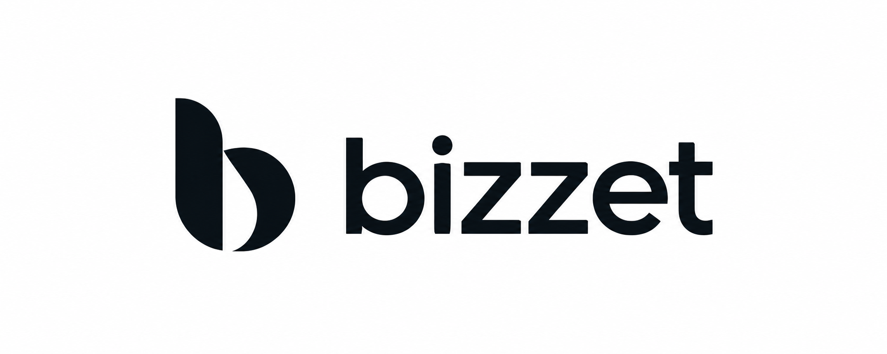

<p align="center"></p>

# bizzet

日本語版: [README_JP.md](README_JP.md)

bizzet is a wallet built for business operations, from receiving sales to managing team funds, with passkey sign-in and multi-member approval on Safe.

## Problem and product vision

A business that accepts crypto payments has to run it as a team: sales arrive at several stores, funds need to be gathered at headquarters, and withdrawals should require more than one person's approval. Ordinary wallets assume a single person holding a seed phrase, which does not fit how a business operates.

In the bizzet vision, an organization is modeled as groups (headquarters and its stores, including online shops), and each group has its own Safe. Members join with a role (Owner, Approver or Viewer) that decides what they can see and do, and rules such as "withdrawals from headquarters need two approvals" are enforced on chain by the Safe threshold. Members sign in and approve with a passkey on their own device, so no one manages private keys and no one pays gas. Store sales are gathered into the headquarters Safe by a keeper that can only send funds there, and a dashboard shows balances, payouts and members.

## What we built during ETHGlobal Tokyo 2026

Everything here runs on Ethereum Sepolia only.

### packages/contracts

| Built | How it was verified |
| --- | --- |
| Verified Sepolia addresses for Safe v1.4.1, Safe4337Module v0.3.0, EntryPoint v0.7, passkey signer v0.2.1, Zodiac Roles v2.1.1, JPYC and USDC | Fork test checks the contracts exist |
| Safe `setup()` calldata for group Safes (no module, CompatibilityFallbackHandler) | Fork test: predicted address and SafeTx hash match the deployed Safe |
| Safe `setup()` calldata for relayer/4337 Safes (Safe4337Module plus passkey signers created in the same `setup()` via MultiSend) | Fork test: end-to-end UserOperation, plus the live Sepolia tx below |
| `predictSafeAddress` (CREATE2) | Fork tests: address matches the deployed Safe |
| EIP-712 hashing for Safe4337 SafeOp and Safe v1.4.1 SafeTx | Fork tests against deployed contracts |
| Passkey (WebAuthn) signature encoding and the viem smart account `toSafePasskeyAccount` | Fork test: passkey-signed UserOperation executed via EntryPoint `handleOps` |
| ERC-20 transfer and owner-change encoders | Used by the dashboard's proposals; not executed on chain yet |
| Nested store Safe approval (`hashNestedSafeTransaction`, `encodeNestedSafeSignature`): HQ owners sign the HQ Safe's SafeMessage over the store SafeTx's raw EIP-712 bytes (`0x1901 ‖ domainSeparator ‖ structHash`), wrapped as the HQ Safe's contract signature (nested ERC-1271) | Fork tests (`test/store-safe-approval.ts`): two HQ owners execute a store `execTransaction`; one signature, or a signature over the wrong message, is rejected |
| Zodiac Roles v2 setup encoding (deploy via ModuleProxyFactory, scope a keeper to JPYC/USDC `transfer` to the HQ Safe only, enable the module) in one MultiSendCallOnly delegatecall | Fork test: keeper can transfer only to the HQ Safe; other recipients and functions are rejected |
| `execTransaction` encoding and passkey signature checks via the signer factory's `isValidSignatureForSigner` | Fork test: two passkey owners' signatures deploy the HQ Safe and execute a payout in one UserOperation; one signature is rejected |
| ENSv2 on Sepolia: HQ `.eth` registration (commit/register with MockUSDC), a subname registry and PermissionedResolver deployed via VerifiableFactory, store subnames, `addr` + `bizzet.currency` + `description` records in one multicall, and `resolveGroupName` through UniversalResolverV2 | Fork tests: register, re-run idempotently, write records and resolve them through the Universal Resolver |
| `ens:setup` script that performs the one-time ENS setup and prints the `ens_settings` row | Same code path as the fork tests; not yet run on live Sepolia |
| Uniswap v4 on Sepolia (`src/uniswap.ts`): V4Quoter exact-output quotes, Universal Router `V4_SWAP` (SWAP_EXACT_OUT_SINGLE + SETTLE_ALL + TAKE to the store Safe), Permit2 approvals, and full-range liquidity via PositionManager | Fork tests (`test/uniswap.ts`): add liquidity, swap JPYC→USDC and USDC→JPYC exact-out; the recipient gets exactly the amount and the quote matches what was paid |
| `uniswap:liquidity` script that adds full-range JPYC/USDC liquidity to the Sepolia pool | Same code path as the fork tests; not yet run on live Sepolia |

The 23 Sepolia fork tests cover: contracts exist; Safe creation; a passkey-signed UserOperation executed end to end through EntryPoint `handleOps`, deploying the Safe and its signer; group Safe address and SafeTx hash match the deployed Safe; the keeper can only transfer to the HQ Safe; two-passkey approval and execution of an HQ payout; nested approval and execution of a store Safe transaction by HQ owners; ENSv2 registration, records and resolution; and Uniswap v4 liquidity and exact-output swaps in both directions.

**Live on Sepolia.** A passkey-signed UserOperation (test P-256 key) was sent through Pimlico's bundler and paymaster via the wallet's server proxy, deploying a Safe and its passkey signer with gas sponsored: [0xe1bfcc21…a6c4](https://sepolia.etherscan.io/tx/0xe1bfcc2134d73fb42c8c8b7e26c7581baeec14ad02d4f0764e610008ab5ca6c4).

### apps/wallet

| Built | How it was verified |
| --- | --- |
| Server-verified passkey login: `/api/session/challenge` issues a one-time challenge (5 min, signed httpOnly cookie), `/api/session` verifies the WebAuthn assertion against the stored public key (challenge, origin, rpId hash, user verification) and sets a 12h HMAC-signed httpOnly session cookie | vitest for cookie signing and assertion checks; manual check in the browser |
| Session-based access: wallet APIs identify the member from the session, and pages other than `/login`, `/pay/**` and `/invite/**` redirect to `/login` | Manual check |
| Signer address computed via the factory's `getSigner` | Manual check; same logic as the fork tests |
| Invite page that registers a passkey to the DB with the public key sent by the browser (member and add-passkey links) | Manual check with links issued by the dashboard |
| `/api/bundler` server proxy that keeps the Pimlico API key server-side and forwards only an allowlisted set of methods | Manual check; the live Sepolia tx above |
| Home: balances of the member's groups (one multicall) and the pending-approval count | API check against a throwaway DB and a dev server |
| Approval screen: HQ Owners/Approvers sign HQ Safe proposals, and store Safe proposals via the nested approval, with their passkey; the server recomputes the safeTxHash, checks the signer is an owner and verifies the signature on chain before storing it | API check (wrong hash, wrong key and duplicate signatures are rejected); fork test for the signature format |
| Execution: once the threshold is met, the last signer submits `execTransaction` through their passkey account (created automatically on first execution) and Pimlico; undeployed group Safes are refused, and the proposal is marked executed only after an `ExecutionSuccess` log | Fork test; not yet sent on live Sepolia |
| Customer payment page `/pay/<ens-name>`: resolves the store's ENS name to its Safe address and receiving currency, shows the price in yen and JPYC/USDC, pays with the customer's browser wallet (ERC-20 `transfer`, or a Uniswap v4 swap when the customer pays in the other currency, delivered straight to the store Safe), and shows 処理中 then 済 | vitest for price parsing and conversion; page render check; not yet paid from a real wallet |
| Price-tag page `/pay`: builds the payment URL and a printable QR code | Page render check |
| Refund requests `/business/refund`: store members request a refund, which becomes a payout proposal on the store Safe marked 返金 | vitest; manual check |
| My page `/mypage`: issues one-hour add-password links for the dashboard, and logout | vitest; manual check |

### apps/dashboard

| Built | How it was verified |
| --- | --- |
| Better Auth email/password login; invitation-only join (member invites and add-password links) | Manual check; `svelte-check` |
| Members: list (shadcn data-table), invite with name/title, edit and remove | Manual check |
| Owner-set changes of the HQ Safe create `owner_change` proposals, guarded (3+ owners, last Owner, self) | Manual check |
| Account page issuing a one-hour add-passkey link for the wallet | Manual check |
| Groups: list, store creation, HQ Safe setup from 3+ passkey owners (threshold 2), store Safe setup, Roles v2 setup proposal | Manual check; encoders covered by fork tests |
| Safe deployment: "Deploy Safe" on group settings sends `createProxyWithNonce` from the operator key with the saved settings; group Safes are deployed only here | Manual check; not yet run on live Sepolia |
| Payouts: list, detail and create for Safe transaction proposals (nonce assignment reusing freed nonces), reject, and sync of submitted proposals to executed | Manual check |
| Home: balances via one multicall | Manual check on Sepolia |
| Deposit indexer: incremental ERC-20 Transfer ingestion with a time budget, and `/api/cron/deposits` protected by a Bearer token | Manual check |
| Bridge page with an empty state (the beta has no bridge) | Manual check |
| Japanese and English via Paraglide (cookie, then browser language, then ja) and a shadcn sidebar | Manual check |
| ENS: a label field on store creation that registers `<label>.<hq>.eth` and writes its records, a retry and currency edit on group settings, and the resolved address and currency on group pages with a warning if ENS and the DB disagree | `svelte-check`; registration code covered by the ENS fork tests |

vitest covers helper logic only: the dashboard's 11 tests cover role rules, member-change helpers and group ordering, and the wallet's 65 tests cover passkey public-key parsing, session cookie signing, WebAuthn assertion checks, price-tag URL parsing and conversion, swap slippage and approval-step planning, which proposals a member can sign, refunds and password links. Type checks pass for both apps.

### packages/db

Drizzle schema and migrations, with local Postgres via docker compose plus a local Neon HTTP proxy. Verified by running `pnpm db:migrate` and `pnpm db:seed` locally.

### docs

A Docusaurus whitepaper and design docs in Japanese (18 pages) with no open items. These describe the full design, including the parts not built yet.

## Built but not yet run on live Sepolia

- **ENS setup**: the `ens:setup` script and store subname registration are verified on a Sepolia fork only; the live HQ name has not been registered yet, so `/pay/<name>` shows "no receiving address" until it is.
- **Payout execution and customer payments**: HQ and nested store Safe execution are verified in fork tests and render checks, not yet with a real passkey or a real customer wallet.
- **Safe deployment from the dashboard**: not yet sent on live Sepolia.
- **Passkey login**: server verification is covered by vitest, but login with a real passkey against the deployed wallet has not been tried yet.

## Not built yet (designed in docs, planned)

The following are designed in `docs/` but are not implemented in this repo.

- **Checkout contract**: a contract that takes the payment and emits `Paid`, and the e-ink price tag. Today the customer's wallet calls Uniswap's Universal Router directly when a swap is needed.
- **Receipts**: Semaphore v4 purchase proofs.
- **Relayer Safe**: execution currently goes through the last signer's own passkey account instead of a bizzet relayer Safe.
- **Passkey attestation verification** at registration: the server stores the public key sent by the browser.
- **Operations**: auto-bridge and CCTP; Gelato keeper deployment and on-chain sweep execution; an automatic owner-add proposal when an HQ member registers a passkey after setup.

## Uniswap v4 integration

Customers can pay in either JPYC or USDC regardless of which one the store receives. When they differ, the payment page quotes the exact-output amount with V4Quoter, and the customer's wallet sends one Universal Router `V4_SWAP` that pays from the customer via Permit2 and `TAKE`s the output straight to the store's Safe, so the store receives exactly the price in its own currency.

| Code | What it does |
| --- | --- |
| `packages/contracts/src/uniswap.ts` | Addresses, pool key, quote, swap and Permit2 encoding, full-range liquidity |
| `packages/contracts/test/uniswap.ts` | Sepolia fork tests for liquidity and both swap directions |
| `packages/contracts/scripts/uniswap-liquidity.ts` | Adds full-range liquidity to the Sepolia JPYC/USDC pool |
| `apps/wallet/src/lib/swap.ts` | Slippage, deadline and approval-step planning on the payment page |
| `apps/wallet/src/routes/pay/[name]/+page.svelte` | Payment page that offers the swap |
| `FEEDBACK.md` | Our feedback on building with Uniswap v4 |

The Sepolia JPYC/USDC pool (fee 0.01%, tick spacing 1, no hooks) was initialized at about 150 JPYC per USDC but had no in-range liquidity, so the swap works on live Sepolia only after running `uniswap:liquidity`:

```sh
LIQUIDITY_PRIVATE_KEY=0x... SEPOLIA_RPC_URL=https://... LIQUIDITY_USDC=20 LIQUIDITY_JPYC=3000 \
  pnpm --filter @bizzet/contracts uniswap:liquidity
```

## Architecture

The beta runs on Ethereum Sepolia only.

| Component | Design | Status |
| --- | --- | --- |
| HQ Safe | Safe v1.4.1 with 3+ passkey owners and threshold 2 | Setup built and fork-tested; deployed from the dashboard |
| Store Safes | Safe whose sole owner is the HQ Safe | Setup built; deployed from the dashboard |
| Member approval | Members sign Safe transactions (EIP-712 SafeTx) with passkeys | Built for HQ Safe proposals and store Safe proposals (nested ERC-1271); fork-tested |
| Relayer | A bizzet relayer Safe with Safe4337Module submits signed transactions via ERC-4337 | Interim: the last signer's passkey account submits `execTransaction` (fork-tested); relayer Safe not built |
| Gas sponsorship | Pimlico paymaster | Built (server proxy in the wallet) |
| Safe deployment | The operator key sends `createProxyWithNonce` for group Safes from the dashboard | Built; not run on live Sepolia |
| Keeper permission | Zodiac Roles v2 scopes a keeper to JPYC/USDC transfers into the HQ Safe only | Encoding built and fork-tested; keeper not deployed |
| Proposals | Payout, owner change and Safe setup proposals stored in Postgres | Built (creation, reject, sync) |
| Receiving settings | Each group's ENSv2 name holds its Safe as the `addr` record and its currency as the `bizzet.currency` text record | Built and fork-tested; live setup not run yet |

Group Safes carry no module, so the only way to move their funds is a SafeTx that meets the owner threshold, plus the keeper's narrowly scoped Roles permission. Members sign SafeTx rather than UserOperations because Pimlico's paymaster sponsorship expires 10 minutes after it is issued, which is too short to collect signatures from several members; the relayer wraps the fully signed SafeTx into its own UserOperation at submission time.

We build Safe calldata ourselves in `packages/contracts` (viem/ox) instead of using the Safe SDK, because we needed to create passkey signers inside `setup()` and to hash Safe4337Module v0.3 SafeOp, which the SDK does not cover.

## Repository layout

| Path | Contents |
| --- | --- |
| `apps/wallet` | Member wallet (SvelteKit, Svelte 5, Tailwind v4, passkeys) |
| `apps/dashboard` | Admin dashboard (SvelteKit, Better Auth, Paraglide ja/en, shadcn-svelte) |
| `packages/contracts` | Safe / ERC-4337 / Roles calldata builders (viem/ox) and Hardhat 3 fork tests |
| `packages/db` | Drizzle schema and migrations, Neon serverless driver |
| `docs` | Docusaurus whitepaper and design docs (Japanese) |

The repo is a pnpm monorepo managed with Biome and Lefthook.

## Running locally

Requires Node.js 20+, pnpm 10 and Docker.

```sh
pnpm install
pnpm db:up       # Docker Postgres + local Neon HTTP proxy
pnpm db:migrate
pnpm db:seed     # creates an Owner: admin@example.com / password (local only)
pnpm dev         # docs :3000, dashboard :5174, wallet :5175
```

The seeded credentials are for local development only.

### Environment variables

`apps/wallet/.env`

| Variable | Purpose |
| --- | --- |
| `PIMLICO_API_KEY` | Pimlico bundler/paymaster key, used server-side only |
| `PUBLIC_PASSKEY_RP_ID` | Optional WebAuthn rpId override |
| `DATABASE_URL` | Postgres URL shared with the dashboard |
| `PUBLIC_SEPOLIA_RPC_URL` | Optional Sepolia RPC endpoint (default `https://ethereum-sepolia-rpc.publicnode.com`, CORS-enabled) |
| `WALLET_SESSION_SECRET` | Key that signs session cookies; required in production, dev falls back to a per-process key |
| `PUBLIC_DASHBOARD_URL` | Dashboard URL used in add-password links (default `http://localhost:5174`) |
| `PUBLIC_PAY_MOCK_RESOLUTION` | Dev server only: `0xaddress,USDC,name` replaces ENS resolution on the payment page, and the page says so |

`apps/dashboard/.env`

| Variable | Purpose |
| --- | --- |
| `DATABASE_URL` | Postgres URL; empty uses the local DB |
| `BETTER_AUTH_SECRET` | Better Auth secret |
| `BETTER_AUTH_URL` | Dashboard base URL |
| `SEPOLIA_RPC_URL` | Optional Sepolia RPC endpoint (same default as the wallet) |
| `KEEPER_ADDRESS` | Keeper address scoped by the Roles v2 setup |
| `CRON_SECRET` | Bearer token for `/api/cron/deposits` |
| `DEPOSITS_START_BLOCK` | Optional first block for the deposit indexer |
| `PUBLIC_WALLET_URL` | Wallet URL used in invite and add-passkey links |
| `ENS_OPERATOR_PRIVATE_KEY` | Operator key that registers store subnames, writes ENS records and deploys group Safes (holds only Sepolia ETH for gas) |

### ENS setup (once)

```sh
ENS_OPERATOR_PRIVATE_KEY=0x... SEPOLIA_RPC_URL=https://... ENS_HQ_LABEL=bizzet \
  ENS_HQ_SAFE_ADDRESS=0x... pnpm --filter @bizzet/contracts ens:setup
```

The script registers `<label>.eth`, deploys the subname registry and resolver, writes the HQ records, and prints the SQL for the `ens_settings` row; run that SQL against the dashboard's database.

## Testing

```sh
# Sepolia fork tests (23 tests)
cd packages/contracts && SEPOLIA_RPC_URL=https://sepolia.gateway.tenderly.co pnpm test

# vitest from the repo root (dashboard 11, wallet 65)
pnpm test

# Dashboard type check
pnpm --filter @bizzet/dashboard run check
```

## AI usage

ETHGlobal asks teams to document where AI tools were used. We used AI heavily.

| Tool | Where it was used |
| --- | --- |
| Claude Code (Anthropic; Claude Opus 5.5, Claude Sonnet 5, Claude Fable 5.1) | Protocol research (Safe, ERC-4337, Pimlico, Zodiac Roles, Semaphore, ENSv2, CCTP) |
| Claude Code | Drafting the Japanese design docs from the team's direction |
| Claude Code | Implementing most code in `packages/contracts`, `packages/db`, `apps/wallet` and `apps/dashboard`, including parallel sub-agents for dashboard features |
| Claude Code | Writing tests and reviewing changes |
| Devin (Cognition) | 10 commits by `devin-ai-integration[bot]`, merged as PRs #1–#11 |

Commits that Claude Code co-authored carry a `Co-Authored-By: Claude …` trailer (64 commits at the time of writing). Devin's PRs covered the dashboard shadcn setup, DB connection, login page, docs deploy fix, invite registration, passkey rpId, Better Auth login, docs additions, and zod + superforms validation with vitest.

The human team member set the product direction and requirements, made every design decision, reviewed and approved changes, and ran the manual checks.

**Spec files.** We used spec-driven development. The specs the AI worked from are in the repo: `docs/docs/*.mdx` (feature list, screens, wallet design and the rest of the design docs) and `CLAUDE.md` (rules for writing the docs).

**Prompts.** The chat prompts are not stored in this repo. They can be provided on request to the ETHGlobal judges.

> TODO (team): export prompts before submission, and replace the line above with where they are published.

## Hackathon timeline

| When (JST) | What |
| --- | --- |
| 2026-09-25 20:57 | First commit (a one-line README) |
| 2026-09-25 21:29 | pnpm workspace with the Docusaurus template and the dashboard app |
| 2026-09-26 – 09-27 | Whitepaper and design docs, contracts, DB, wallet and dashboard (44+ commits in total) |

Public boilerplates we started from: Docusaurus, SvelteKit, shadcn-svelte and the Hardhat 3 template. Everything else was written during the event.
